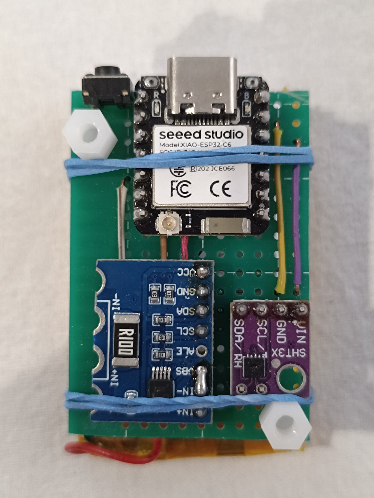

# Zigbee Czujnik Temperatury i Wilgotności z Deep Sleep

[Polski](#polski) | [English](#english)

**Wersja:** 1.0 &nbsp;|&nbsp; **Autor:** Maciej Sikorski &nbsp;|&nbsp; **Data:** 30.03.2026 &nbsp;|&nbsp; **Licencja:** Apache 2.0

---

## Opis

Czujnik Zigbee End Device oparty na płytce **Seeed Studio XIAO ESP32C6**.  
Co 10 minut budzi się z deep sleep, mierzy temperaturę i wilgotność (SHT3x) oraz napięcie baterii LiPo (INA226), wysyła dane do sieci Zigbee i ponownie zasypia.

---

## Zdjęcie



*XIAO ESP32C6 (góra) + INA226 (lewy dół) + SHT3x (prawy dół)*


---

## Cechy

-  **Efektywny energetycznie:** Deep sleep 10 minut, ~5–6 lat na baterii LiPo 2000 mAh
-  **Niezawodny:** Retry logic dla czujników, RTC fallback, thread-safe
-  **Monitorowanie baterii:** Napięcie + procent rozładowania
-  **Dokładne pomiary:** SHT3x (±0.3°C, ±2% RH), timeout + walidacja zakresu
-  **Factory Reset:** Przycisk BOOT (> 3 s) resetuje Zigbee binding
-  **Integracja SmartThings:** Zaprojektowany z myślą o Samsung SmartThings

---

## Sprzęt

| Komponent | Model |
|---|---|
| Płytka | Seeed Studio XIAO ESP32C6 |
| Czujnik T/H | SHT30 / SHT31 / SHT35 (SHT3x) |
| Monitor baterii | INA226 |
| Bateria | Li-Pol / LiPo 3.7V |

---

## BOM (Lista części)

| Lp. | Komponent | Model | Ilość | Źródło |
|---|---|---|---|---|
| 1 | Płytka | XIAO ESP32C6 | 1 | Seeed Studio |
| 2 | Czujnik T/H | SHT31 | 1 | Adafruit / AliExpress |
| 3 | Monitor baterii | INA226 | 1 | AliExpress |
| 4 | Bateria LiPo | 503450 (500 mAh) / 704050 (2000 mAh) | 1 | AliExpress |
| 5 | Kondensator ceramiczny | 100 nF (dla SHT3x, INA226) | 2 | AliExpress |
| 6 | Rezystor pull-up | 10 kΩ (opcjonalnie) | 2 | AliExpress |

>  Całkowity koszt (~2026): **~25–40 PLN** (bez baterii)

---

## Schemat podłączenia

### XIAO ESP32C6 → SHT3x

| XIAO ESP32C6 | SHT3x |
|---|---|
| GPIO22 (SDA) | SDA |
| GPIO23 (SCL) | SCL |
| 3.3V | VCC |
| GND | GND |

> Adres I2C: `0x44` (domyślny)

---

### XIAO ESP32C6 → INA226

| XIAO ESP32C6 | INA226 |
|---|---|
| GPIO22 (SDA) | SDA |
| GPIO23 (SCL) | SCL |
| 3.3V | VCC |
| GND | GND |
| BAT+ | VIN- |
| BAT- | GND |

### INA226 → Bateria LiPo

| INA226 | Podłączenie |
|---|---|
| VIN+ | (+) baterii LiPo |
| VIN- | zwarte z V_BUS |
| V_BUS | zwarte z VIN- |
| GND | (-) baterii LiPo |

> INA226 mierzy napięcie szyny (bus voltage) jako napięcie baterii.

---

### Przycisk BOOT

| XIAO ESP32C6 | |
|---|---|
| GPIO0 | Przycisk → GND |

> Przytrzymaj > 3 sekundy → Factory Reset (miga LED)

---

## Instalacja

### Krok 1: Arduino IDE + pakiet ESP32

1. `File → Preferences → Additional Boards Manager URLs` — dodaj:
   ```
   https://espressif.github.io/arduino-esp32/package_esp32_index.json
   ```
2. `Tools → Board Manager` — wyszukaj `esp32` → zainstaluj **Espressif Systems** (wersja **3.x+**)
3. `Tools → Board → ESP32 Arduino → XIAO_ESP32C6`

### Krok 2: Biblioteki

`Sketch → Include Library → Manage Libraries`

| Biblioteka | Autor |
|---|---|
| `Adafruit SHT31 Library` | Adafruit |
| `Adafruit INA219` | Adafruit |
| `Adafruit BusIO` | Adafruit (zależność) |

> **Uwaga:** Biblioteka `Adafruit INA219` jest używana z układem INA226.  
> Działa poprawnie dla odczytu napięcia szyny (bus voltage).

### Krok 3: Wgrywanie

1. `Tools → Zigbee mode → Zigbee ED (end device)`  **WYMAGANE**
2. `Tools → Partition Scheme → Zigbee 4MB with spiffs`
3. `Sketch → Upload`
4. Po wgraniu przytrzymaj BOOT > 3 s → Factory Reset

---

## Konfiguracja zaawansowana

Edytuj w pliku `.ino`:

```c
#define TIME_TO_SLEEP  600       // Deep sleep (sekundy). 300 = 5 min, 1800 = 30 min.
#define REPORT_TIMEOUT 6000      // Czekaj na ACK (ms)
#define DEBUG_ENABLED  1         // Zmień na 0 dla produkcji

// INA226 — zakres napięcia baterii
#define LIPO_MAX_VOLTAGE  4.20f  // 100% (pełna)
#define LIPO_MIN_VOLTAGE  3.00f  // 0%  (rozładowana)
```

| Wartość `TIME_TO_SLEEP` | Opis |
|---|---|
| 300 s (5 min) | Częstsze odczyty, krótszy czas pracy baterii |
| 600 s (10 min) | Domyślnie — dobry balans |
| 1800 s (30 min) | Minimalne zużycie energii, spóźnione alarmy |

---

## Działanie

```
[Budzenie]
     ↓
[Odczyt SHT3x: T + RH]
     ↓
[Odczyt INA226: napięcie baterii]
     ↓
[Połączenie Zigbee]
     ↓
[Raport Zigbee: T, RH, % baterii]
     ↓
[Deep sleep 10 min]
```

---

## Pobór prądu

| Stan | Prąd | Czas | Energia |
|---|---|---|---|
| Deep sleep | 5–10 µA | 599 s | ~50–100 µJ |
| Wake + Zigbee | 50–100 mA | 1 s | ~50–100 mJ |
| Czytanie czujników | 10 mA | 0.5 s | ~5 mJ |
| Wysyłanie | 100–150 mA | 0.5 s | ~50–75 mJ |
| **Cykl** | — | 600 s | **~125 mJ** |

### Estymacja czasu pracy

- **Bateria:** 2000 mAh LiPo (3.7 V, ~7.4 Wh)
- **Pobór:** ~125 mJ/cykl (10 min)
- **Cykli dziennie:** 144
- **Szacowany czas pracy:** ~5–6 lat *(teoretycznie)*

> Rzeczywisty czas pracy zależy od stabilności sieci Zigbee (słaba sieć = częstsze retry), temperatury otoczenia (zimna bateria = niższe napięcie) i wilgotności.

---

## Integracja SmartThings

Czujnik był projektowany i budowany z myślą o integracji z **Samsung SmartThings**.  
Po sparowaniu czujnik pojawia się jako urządzenie **Temperature and Humidity** z atrybutem Battery.

| Atrybut | Zakres | Dokładność |
|---|---|---|
| Temperatura | −40°C … 85°C | ±0.3°C |
| Wilgotność | 0% … 100% | ±2% RH |
| Bateria | 0% … 100% | zakres 3.0–4.2 V |

Po sparowaniu czujnik będzie:
-  Wysyłać dane co 10 minut
-  Wysyłać alert jeśli bateria < 10%
-  Pokazywać status "Connected" / "Offline"

>  SmartThings uznaje urządzenie za offline jeśli nie komunikuje się przez > 1 godzinę.  
> To zachowanie jest normalne dla czujnika z deep sleep.

---

## Kompatybilność Zigbee

| Hub / Coordinator | Status |
|---|---|
| **Samsung SmartThings** |  Docelowy |
| Home Assistant + ZHA |  Nie testowano |
| Zigbee2MQTT |  Nie testowano |

---

## Rozwiązywanie problemów

### Czujnik nie pojawia się w SmartThings

- Czy wybrano `Tools → Zigbee mode → Zigbee ED`?  WYMAGANE
- Czy Hub SmartThings jest w trybie parowania?
- Czy bateria ma co najmniej 3.5 V?
- Czekaj do 2 minut — pierwsze budzenie może być wolne

### Czujnik wysyła dane rzadziej niż co 10 minut

- Sieć Zigbee mogła zmienić polling interval
- Usuń urządzenie ze SmartThings → dodaj ponownie → obserwuj logi

### SHT3x zwraca 0.0°C / INA226 nie odpowiada

Sprawdź wyjście Serial Monitor:
```
[DEBUG] SHT3x OK.              ← dobrze
[ERROR] SHT3x nie znaleziony!  ← problem z podłączeniem
```
- Sprawdź połączenia SDA/SCL
- Zweryfikuj adresy I2C: `0x44` (SHT3x), `0x40` (INA226)
- Rozważ dodanie rezystorów pull-up 10 kΩ na SDA/SCL

### LED nie miga po budzeniu

To normalne! LED miga tylko gdy czujnik **nie jest** połączony z siecią Zigbee.  
Po połączeniu LED pozostaje ciemny (oszczędzanie baterii).

### Serial Monitor pokazuje same błędy I2C

- Sprawdź pull-upy na SDA/SCL
- Sprawdź zasilanie — spróbuj innego LDO lub baterii o wyższej pojemności

---

## Struktura repozytorium

```
├── README.md
├── LICENSE
├── .gitignore
├── Zigbee_Temp_Hum_Sensor_Sleepy.ino
└── images/
    ├── PCB.jpg
    ├── Schemat.jpg
    ├── SHT3x_pinout.jpg
    ├── ina226_pinout.jpg
    └── xiao_esp32c6_pinout.jpg
```

---

## Licencja

Ten projekt oparty jest na przykładzie Espressif Systems objętym licencją Apache 2.0.

Copyright 2026 Maciej Sikorski  
Copyright 2024 Espressif Systems (Shanghai) PTE LTD

Zobacz plik [LICENSE](LICENSE) po pełny tekst licencji.

---
---

# Zigbee Temperature & Humidity Sensor with Deep Sleep

**Version:** 1.0 &nbsp;|&nbsp; **Author:** Maciej Sikorski &nbsp;|&nbsp; **Date:** 30.03.2026 &nbsp;|&nbsp; **License:** Apache 2.0

---

## Description

A Zigbee End Device based on the **Seeed Studio XIAO ESP32C6**.  
Every 10 minutes it wakes from deep sleep, measures temperature & humidity (SHT3x) and LiPo battery voltage (INA226), reports to Zigbee network, then sleeps again.

---

## Photo


*XIAO ESP32C6 (top) + INA226 (bottom left) + SHT3x (bottom right)*


---

## Features

-  **Power efficient:** Deep sleep 10 minutes, ~5–6 years on a 2000 mAh LiPo battery
-  **Reliable:** Retry logic for sensors, RTC fallback, thread-safe
-  **Battery monitoring:** Voltage + discharge percentage
-  **Accurate measurements:** SHT3x (±0.3°C, ±2% RH), timeout + range validation
-  **Factory Reset:** BOOT button (> 3 s) resets Zigbee binding
-  **SmartThings integration:** Designed for Samsung SmartThings

---

## Hardware

| Component | Model |
|---|---|
| Board | Seeed Studio XIAO ESP32C6 |
| T/H Sensor | SHT30 / SHT31 / SHT35 (SHT3x) |
| Battery monitor | INA226 |
| Battery | Li-Pol / LiPo 3.7V |

---

## BOM (Parts list)

| No. | Component | Model | Qty | Source |
|---|---|---|---|---|
| 1 | Board | XIAO ESP32C6 | 1 | Seeed Studio |
| 2 | T/H Sensor | SHT31 | 1 | Adafruit / AliExpress |
| 3 | Battery monitor | INA226 | 1 | AliExpress |
| 4 | LiPo battery | 503450 (500 mAh) / 704050 (2000 mAh) | 1 | AliExpress |
| 5 | Ceramic capacitor | 100 nF (for SHT3x, INA226) | 2 | AliExpress |
| 6 | Pull-up resistor | 10 kΩ (optional) | 2 | AliExpress |

>  Total cost (~2026): **~25–40 PLN** (without battery)

---

## Wiring diagram

### XIAO ESP32C6 → SHT3x

| XIAO ESP32C6 | SHT3x |
|---|---|
| GPIO22 (SDA) | SDA |
| GPIO23 (SCL) | SCL |
| 3.3V | VCC |
| GND | GND |

> I2C address: `0x44` (default)

---

### XIAO ESP32C6 → INA226

| XIAO ESP32C6 | INA226 |
|---|---|
| GPIO22 (SDA) | SDA |
| GPIO23 (SCL) | SCL |
| 3.3V | VCC |
| GND | GND |
| BAT+ | VIN- |
| BAT- | GND |

### INA226 → LiPo battery

| INA226 | Connection |
|---|---|
| VIN+ | LiPo (+) |
| VIN- | shorted to V_BUS |
| V_BUS | shorted to VIN- |
| GND | LiPo (-) |

> INA226 measures bus voltage as battery voltage.

---

### BOOT button

| XIAO ESP32C6 | |
|---|---|
| GPIO0 | Button → GND |

> Hold > 3 seconds → Factory Reset (LED blinks)

---

## Installation

### Step 1: Arduino IDE + ESP32 package

1. `File → Preferences → Additional Boards Manager URLs` — add:
   ```
   https://espressif.github.io/arduino-esp32/package_esp32_index.json
   ```
2. `Tools → Board Manager` — search `esp32` → install **Espressif Systems** (version **3.x+**)
3. `Tools → Board → ESP32 Arduino → XIAO_ESP32C6`

### Step 2: Libraries

`Sketch → Include Library → Manage Libraries`

| Library | Author |
|---|---|
| `Adafruit SHT31 Library` | Adafruit |
| `Adafruit INA219` | Adafruit |
| `Adafruit BusIO` | Adafruit (dependency) |

> **Note:** The `Adafruit INA219` library is used with the INA226 chip.  
> It works correctly for bus voltage reading.

### Step 3: Upload

1. `Tools → Zigbee mode → Zigbee ED (end device)`  **REQUIRED**
2. `Tools → Partition Scheme → Zigbee 4MB with spiffs`
3. `Sketch → Upload`
4. After upload hold BOOT > 3 s → Factory Reset

---

## Advanced configuration

Edit in the `.ino` file:

```c
#define TIME_TO_SLEEP  600       // Deep sleep (seconds). 300 = 5 min, 1800 = 30 min.
#define REPORT_TIMEOUT 6000      // Wait for ACK (ms)
#define DEBUG_ENABLED  1         // Set to 0 for production

// INA226 — battery voltage range
#define LIPO_MAX_VOLTAGE  4.20f  // 100% (fully charged)
#define LIPO_MIN_VOLTAGE  3.00f  // 0%  (empty)
```

| `TIME_TO_SLEEP` value | Description |
|---|---|
| 300 s (5 min) | More frequent readings, shorter battery life |
| 600 s (10 min) | Default — good balance |
| 1800 s (30 min) | Minimal energy use, delayed alerts |

---

## Operation

```
[Wake up]
    ↓
[Read SHT3x: T + RH]
    ↓
[Read INA226: battery voltage]
    ↓
[Zigbee connect]
    ↓
[Zigbee report: T, RH, battery %]
    ↓
[Deep sleep 10 min]
```

---

## Power consumption

| State | Current | Duration | Energy |
|---|---|---|---|
| Deep sleep | 5–10 µA | 599 s | ~50–100 µJ |
| Wake + Zigbee | 50–100 mA | 1 s | ~50–100 mJ |
| Sensor read | 10 mA | 0.5 s | ~5 mJ |
| Transmission | 100–150 mA | 0.5 s | ~50–75 mJ |
| **Cycle** | — | 600 s | **~125 mJ** |

### Battery lifetime estimate

- **Battery:** 2000 mAh LiPo (3.7 V, ~7.4 Wh)
- **Consumption:** ~125 mJ/cycle (10 min)
- **Cycles per day:** 144
- **Estimated runtime:** ~5–6 years *(theoretically)*

> Actual runtime depends on Zigbee network stability (weak network = more retries), ambient temperature (cold battery = lower voltage), and humidity.

---

## SmartThings Integration

The sensor was designed and built for integration with **Samsung SmartThings**.  
After pairing, the sensor appears as a **Temperature and Humidity** device with a Battery attribute.

| Attribute | Range | Accuracy |
|---|---|---|
| Temperature | −40°C … 85°C | ±0.3°C |
| Humidity | 0% … 100% | ±2% RH |
| Battery | 0% … 100% | range 3.0–4.2 V |

After pairing the sensor will:
-  Send data every 10 minutes
-  Send alert if battery < 10%
-  Show "Connected" / "Offline" status

>  SmartThings marks the device as offline if it doesn't communicate for > 1 hour.  
> This is expected behavior for a deep sleep sensor.

---

## Zigbee compatibility

| Hub / Coordinator | Status |
|---|---|
| **Samsung SmartThings** |  Target platform |
| Home Assistant + ZHA |  Not tested |
| Zigbee2MQTT |  Not tested |

---

## Troubleshooting

### Sensor not appearing in SmartThings

- Did you select `Tools → Zigbee mode → Zigbee ED`?  REQUIRED
- Is the SmartThings Hub in pairing mode?
- Does the battery have at least 3.5 V?
- Wait up to 2 minutes — first boot may be slow

### Sensor reports less often than every 10 minutes

- Zigbee network may have changed polling interval
- Remove device from SmartThings → re-add → observe logs

### SHT3x returns 0.0°C / INA226 not responding

Check Serial Monitor output:
```
[DEBUG] SHT3x OK.              ← good
[ERROR] SHT3x nie znaleziony!  ← wiring issue
```
- Check SDA/SCL connections
- Verify I2C addresses: `0x44` (SHT3x), `0x40` (INA226)
- Consider adding 10 kΩ pull-up resistors on SDA/SCL

### LED not blinking after wake

This is normal! LED blinks only when the sensor is **not** connected to a Zigbee network.  
After connecting LED stays dark (battery saving).

### Serial Monitor shows only I2C errors

- Check pull-ups on SDA/SCL
- Check power supply — try a different LDO or higher capacity battery

---

## Repository structure

```
├── README.md
├── LICENSE
├── .gitignore
├── Zigbee_Temp_Hum_Sensor_Sleepy.ino
└── images/
    ├── PCB.jpg
    ├── Schemat.jpg
    ├── SHT3x_pinout.jpg
    ├── ina226_pinout.jpg
    └── xiao_esp32c6_pinout.jpg
```

---

## License

This project is based on an Espressif Systems example covered by the Apache 2.0 license.

Copyright 2026 Maciej Sikorski  
Copyright 2024 Espressif Systems (Shanghai) PTE LTD

See [LICENSE](LICENSE) file for full license text.
